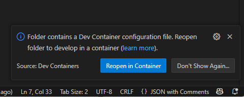

# DotNet DevContainer Playground

This is a simple repository to experiment with devcontainers for .NET (C#).

In this case, I want to start from scratch, without relying on functions available via VSCode extension.

## Steps

- Create a repository
- Add folder `.decontainer`
- Create `devcontainer.json` inside `.decontainer`

  This file defines the container we will be using to developer an application: we do not need dotnet to be installed on the host machine.

## What's inside `devcontainer.json`?

Our `devcontainer.json` contains is very minimal, and makes sense just for this sample application: nonetheless, it is important to understand how it works, so we analyze each item in it.

```json
{
  "name": "dotnet",
  "image": "mcr.microsoft.com/devcontainers/dotnet:1.4.2-8.0-bookworm",
	"customizations": {
		"vscode": {
			"extensions": [
				"ms-dotnettools.csdevkit"
			]
		}
	}
}
```

- `name` just gives a name to devcontainer

  > **Note for me**: not sure how it is used or surfaced to the user

- `image` identifies the image the devcontainer will be created from.

  In this case, we're using an image based on Debian 12 (`bookwork`), which contains dotnet SDK v8.0, plus additional tools (i.e., `htop`, `less`, `sudo`, etc.)

  > A list of tools installed in addition to .NET SDK is available in [GitHub](https://github.com/devcontainers/images/blob/main/src/dotnet/history/dev.md)

- `customization` is optional, and allows you to customize the development environment "per-tool" (e.g. vscode or IntelliJ): in this case, we want "C# Dev Kit" to be installed when using VS Code.

Once we have `devcontainer.json`, we don't need anything else to start developing in C#; if we're using VS Code and "Dev Containers" extension installed ("ms-vscode-remote.remote-containers"), we can then open that folder in VS Code: since VS Code sees there's a `devcontainer.json`, it will offer to reopen the folder using DevContainers.


